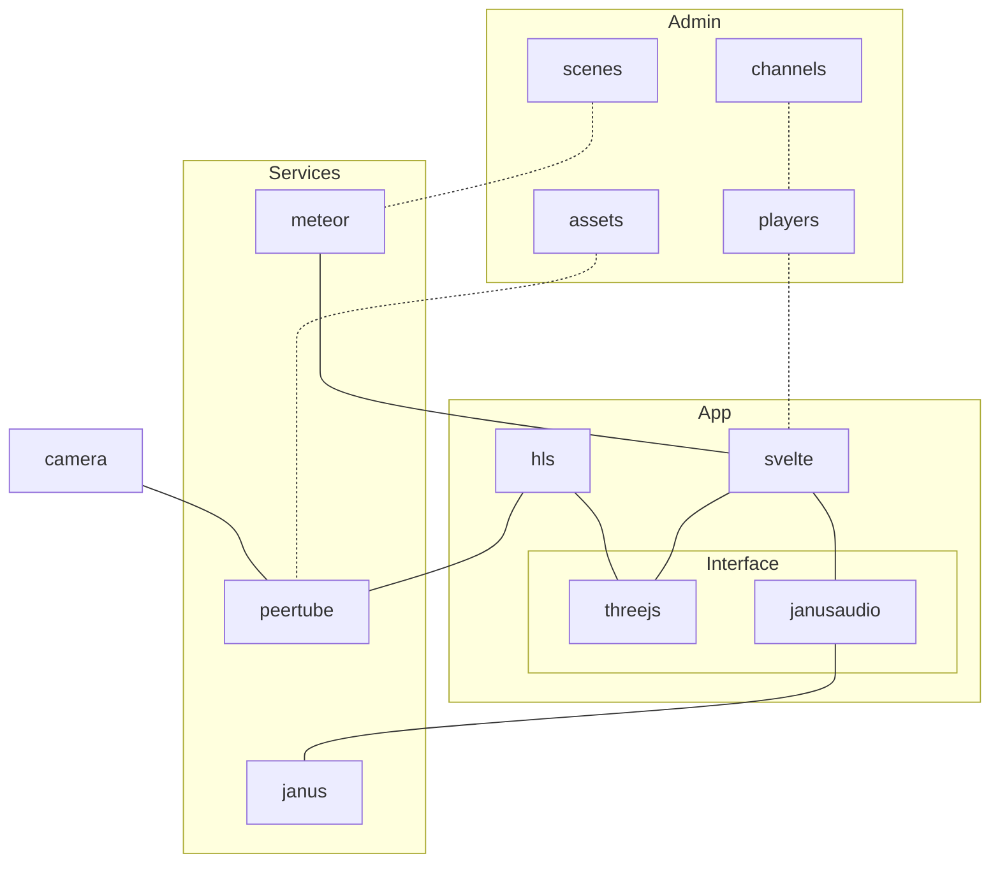

# 360vr

## Deploy

Prerequisites:
- a server with `docker` and  `docker compose`
- a domain name, example: `360vr.intergestalt.cloud`

1. set up DNS for subdomains
    - `360vr.intergestalt.cloud`
    - `*.360vr.intergestalt.cloud`
2. set up network for reverse proxy
    - `docker network create proxy`
3. configure variables in `.env`
    - `cd deploy`
    - `cp .env.example .env`
    - edit `.env`
4. start services
    - `cd deploy`
    - `docker compose build`
    - `docker compose up -d`
