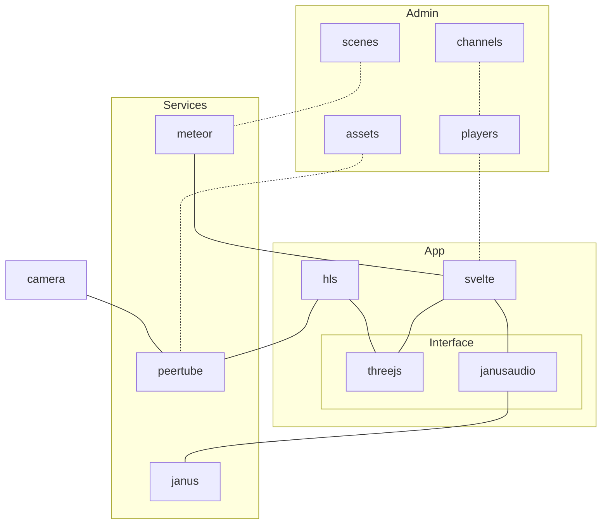

# 360vr

360vr is a system to remotely control 360° Videos on multiple devices simulatenously and connect them via live audio conference rooms.

## Docs

Read the [docs](https://retani.github.io/360vr/)

or access the markdown files directly
- [Intro](docs/README.md)
- [Server Setup](docs/server_setup.md)
- [Admin Interface](docs/admin_interface)
- [Clients Guide](docs/clients_guide.md)

## Stack

- [meteorjs](https://www.meteor.com/)
- [janusaudio](https://janus.conf.meetecho.com/audiobridgetest.html)
- [svelte](https://svelte.dev/)
- [docker](https://www.docker.com/)

## Repo structure

- `app` 360vr server and web clients (meteorjs + svelte)
- `deploy` docker configs, janus server
- `docs` documentation (markdown + docsify)

## Development

requirements:
- `meteor`

```bash
cd app
cp .env.example .env
# edit .env
meteor npm install
npm run dev
```

notes:
- `LOCAL_MEDIA_PATH` and `LOCAL_HLS_PATH` need to be absolute paths

## System architecture


