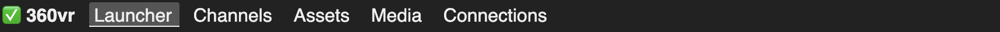
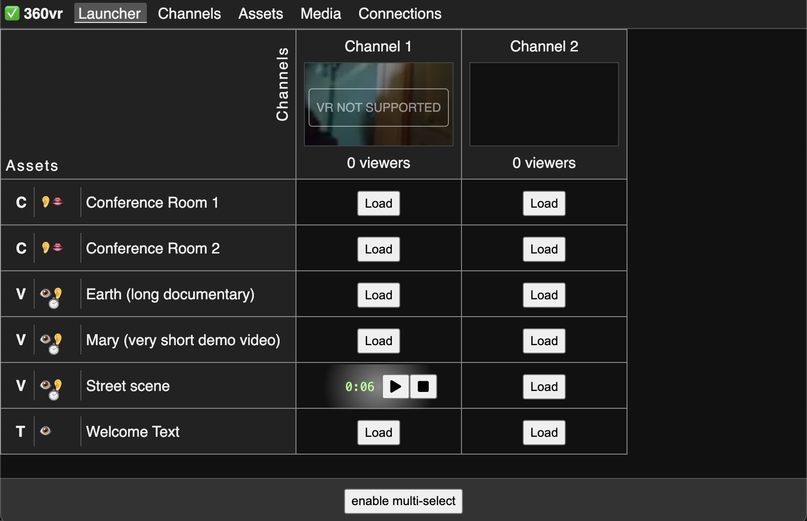
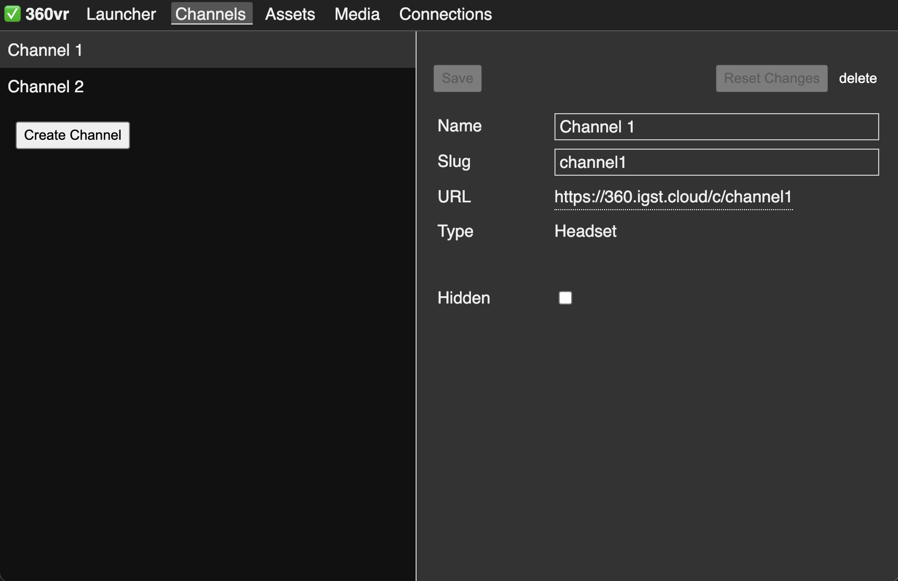
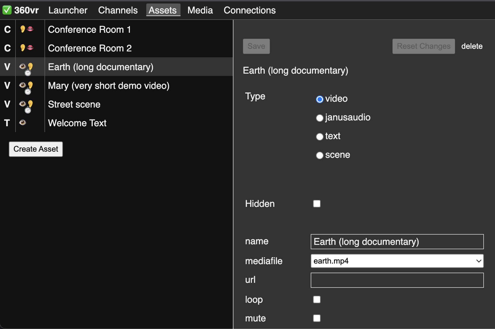

# Admin Interface

Visit the `/admin` route to see the admin interface.

For example, if your web domain is `360.igst.cloud`, the admin interface is at [https://360.igst.cloud/admin](https://360.igst.cloud/admin)

## Sections

The interface features main section that you can selet on top:

- Launcher: The central grid to control the clients
- Channels: Manage channels to organise your clients
- Assets: Prepare assets that are launched in the Launcher
- Media: Upload videos and other files
- Connections: Observe who is connected to understand what's going on

### Launcher

The Launcher is the heart of the system. It controls which assets play on which clients.

It is organized as a grid:
- The columns are the channels
- The rows are the assets
- The cells represent an asset in a channel

#### Channels (Columns)

From top to bottom:

##### Name of the channel

example: "Channel 1"

##### Preview

This mirrors what the clients should see. Click to open the client view of the channel in a new tab. Right click to copy the URL of the channel view to send it to your audience.

##### Number of viewers

This represents the number of clients that are connected to this channel. Every tab or browser windows that is on the channel URL counts as a viewer as it will show the assets assigned to the channel.

#### Assets (Rows)

See the [assets](#assets) section for details

##### Name

This is simply the name that the admin user gave the asset

### Channels

The `Channels` section allows to set up channels. Channels lets you separate the audience. You can control what viewer see in each channel individually.

For example, if you have 2 groups that should see to different videos at the same time, set up to channels "Group A" and "Group B".

#### Left side of the view

A list of the channels.

Click on a channel to select it. Details of the selected channel show up on the right.

#### Right side of the view

Actions:
- `Save` Available if there are unsaved changes: save
- `Reset Changes` Available if there are unsaved changes: reset
- `Delete` Delete this channel

Attributes:
- `Name` An arbitrary name the you should use to remember what this channels is about
- `Slug` an internal identifier. It can only consist of letters, numbers, underscores and dashes. It is used to generate the URL
- `URL` this is the auto-generated URL to view the channel
- `Type` only `headset` at the moment, but there may be more later
- `Hidden` Temporarily hide this channel from the interface

### Assets

#### Left side of the view

A list of the Assets.

Symbols indicate details of an asset. From left to right:

##### Asset Type

- `V` Video
- `C` Audio Conference
- `T` Text

##### Modalities / Senses

- 👁️ uses the display (can be seen)
- 👂 uses the speakers (can be heard)
- ⏱️ is time based media (moves, plays)
- 👄 uses the microphone, listens (can be spoken to)

Click on an asset to select it. Details of the selected asset show up on the right.

#### Right side of the view

Actions:
- `Save` Available if there are unsaved changes: save
- `Reset Changes` Available if there are unsaved changes: reset
- `Delete` Delete this asset

General Attributes:
- `Type` Assets can be of several types. Each types has different attributes.
- `Hidden` Temporarily hide this asset from the interface
- `Name` An arbitrary name that helps you to identify the asset

Attributes of type `video`:

- `mediafile` an uploaded mediafile
- `loop` play the video in a loop
- `mute` mute the video

Attributes of type `janusaudio`

- `url` url of the janus server. this is normally the root domain of your installation with wss protocol. Example: `wss://janus.360.igst.cloud`
- `room` the janusaudio room. The default installation has these for rooms: 1000, 1001, 1002, 1003
- `apisecret` this is like a password for the rooms. The default installation simply uses "secret"

Attributes of type `text`

- `text` Any combination of characters you like

Attributes of type `scene` (experimental)

- `mediafile` an uploaded 3D scene

### Media

The media sections let you upload media files. This is mostly used for videos.

⚠️ Important: After you upload a video, the transcoding process starts. This can take a while. Depending on the processing power of your instance, it typically takes a multiple of the duration of the uplaoded video. For example, if you uplaod a 1 minute video, transcoding may take 5 minutes. During this time, you videos do not play properly.  
Transcoding is only done once per file right after upload.

Delete unused files to free space.

### Connections

Use this tab to see who is connected to you instance and to which channels. This is only for information.
