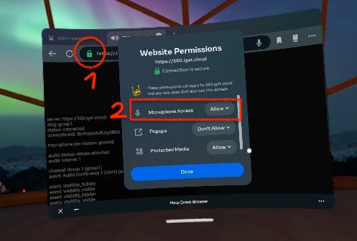
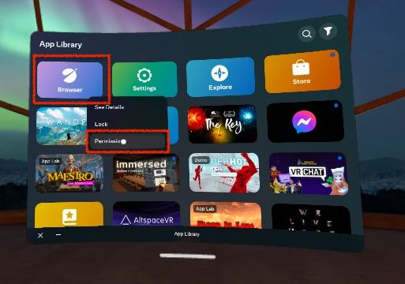

# What is a client?

Any device used to **view** an experience designed with *360vr* is considered a client. More precisely, it's a website run in a browser, typically in the browser of a VR headset.

## How to start

You can start by opening the root domain of a 360vr server, for example: https://360.igst.cloud, which opens a list of Channels to choose from.

Or share a direct link to a Channel, for example https://360.igst.cloud/c/channel1

If the device supports immersive (360°) view, a button "View in VR" will appear.

## How to enable microphone permissions

Enabling the microphone permissions can be tricky. Here is a guide for Oculus.

### Oculus Browser

- 
- 
- 