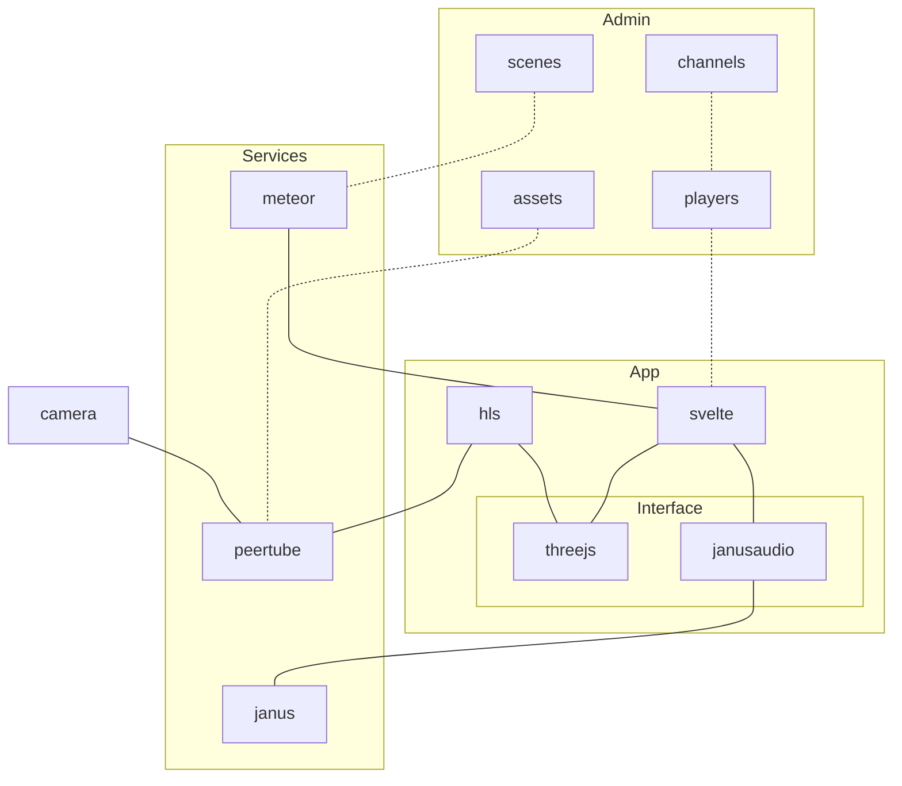

# Server Setup

You need to set up a server first. This requires some technical knowledge.

You need a server instance on a cloud provider like Hetzner, Digital Ocean, AWS, etc.

You also need to have web domain to connect to.

This example uses `360vr.intergestalt.cloud` as an example for the domain.

## Deploy

Prerequisites:
- a server with `docker` and  `docker compose`
- a domain name, example: `360vr.intergestalt.cloud`

1. set up DNS for subdomains
    - `360vr.intergestalt.cloud`
    - `*.360vr.intergestalt.cloud`
2. set up network for reverse proxy
    - `docker network create proxy`
3. configure variables in `.env`
    - `cd deploy`
    - `cp .env.example .env`
    - edit `.env
4. configure janus
    - set public ip in `nat_1_1_mapping` in `janus/etc/janus/janus.jcfg.live`, see https://towardsaws.com/setting-up-janus-webrtc-on-aws-a8aa8914b0c6`
5. start services
    - `cd deploy`
    - `docker compose build`
    - `docker compose up -d`

### optional: use coturn

In order to be independent from google you can setup your own TURN server:

```
docker run -d --network=host \
           -e DETECT_EXTERNAL_IP=yes \
           -e DETECT_RELAY_IP=yes \
           coturn/coturn \
           -n --log-file=stdout
```

and adjust 2 lines in `janus/etc/janus/janus.jcfg.live`

## System architecture

